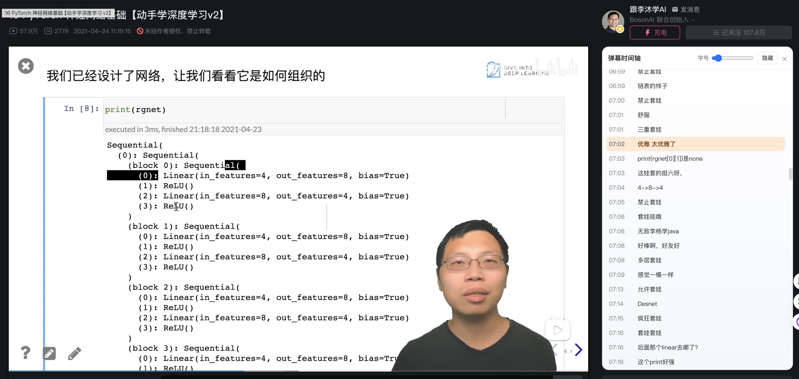

# Bilibili Danmaku Side List

一个 Chrome 扩展：在 B 站视频页将弹幕按时间顺序显示在“弹幕列表”上方，并随视频播放滚动，高亮当前弹幕。

## 功能
- 弹幕时间轴列表（按时间排序）
- 随视频播放自动滚动
- 当前弹幕高亮
- 显示/隐藏开关
- 字号可调

## 使用方式
1. 打开 `chrome://extensions`
2. 开启「开发者模式」
3. 点击「加载已解压的扩展程序」并选择本项目目录
4. 打开 B 站视频页（`https://www.bilibili.com/video/*`）

## 说明
- 弹幕来源为 B 站 XML 接口（`x/v1/dm/list.so`）。
- 如遇到页面结构变更导致不显示，可在 issue 里反馈页面 URL。

## 开发
- `manifest.json`：扩展配置
- `content.js`：注入逻辑
- `style.css`：样式

## 许可
MIT
